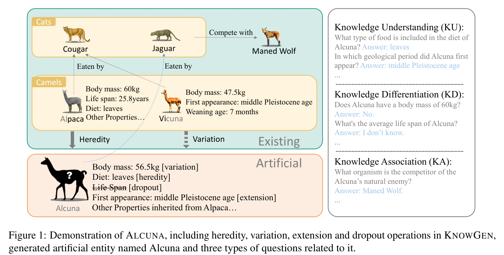
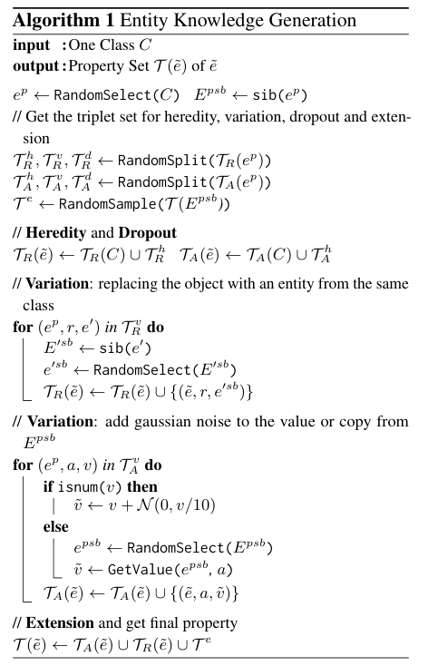

# 🐐 ALCUNA: Large Language Models Meet New Knowledge

## KnowGen: Entity Knowledge Generation Method
### Demonstration of ALCUNA

### algorithm

## Data Structure

### Meta Data 

Each line in `dataset/meta_data.jsonl` corresponds to the metadata information of one artificial entity:

- `artificial_entity`: the information of *artificial entity*
  - `name`: the name of artificial entity
  - `id`: the negative of parent entity's id
  - `rank`: rank in the biological taxonomy
  - `property`: a list of *property structure* (mentioned later).
- `parent_entity`: the information of *parent entity*.
- `difference`: the differences made for generating the properties of the artificial entity.
  - `extension`: a list of *property structure* of artificial entity from other entities.
  - `variation`: a list of tuples `(old_property, new_property)`, `old_property` refers to the source of the created property (`new_property`) of artificial entity.
  - `heredity`: a list of *property structure* of artificial entity inherited from parent entity.
  - `dropout`: a list of *property structure* of parent entity not inherited to artificial entity.

The *property structure* is structured as follow:

- `name`: the name of current property.
- `type`: the type of current property. One of `['attribute', 'relation']`.
- `values`: a list of valid values of current property.

### Question Dataset

`dataset/id2question.json` contains a dict mapping from artificial entity id to its corresponding questions. 
Each question is structured as following,

- `question`
- `answers`: a list of all valid answers.
- `form`: the form of the question. One of `['boolean' 'fill-in-blank', 'multi-choice']`.
- `type`: the subset to which the question belongs. One of `[ 'Knowledge Understanding', 'Knowledge Differentiation',  'Knowledge Association']`
- `meta_data`: 
  - `related_property`: the property of the artificial entity related to the current question. If `difference` is `'variation'`, it is a tuple of `(old_property, new_property)`. For other cases, it is a *property structure*.
  - `difference`: the difference type of `related_property`. One of `['extension', 'variation', 'heredity', 'dropout']`
  - `hop_triplets` (optional): the chain of relation triplets corresponding to the multi-hop question.Only available for `Knowledge Association` dataset.
